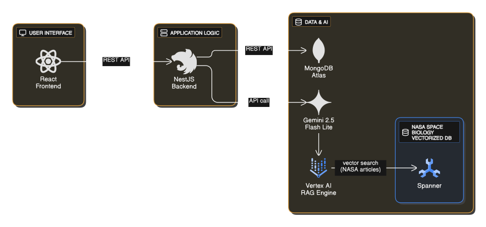
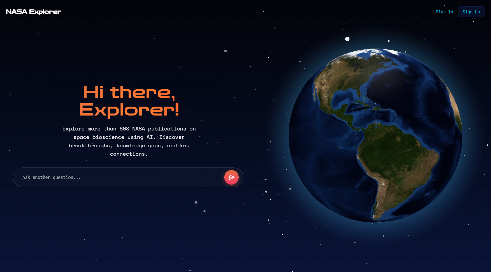
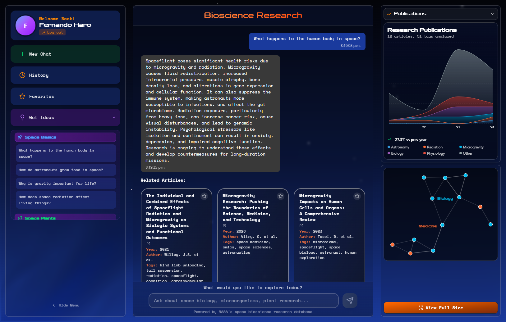
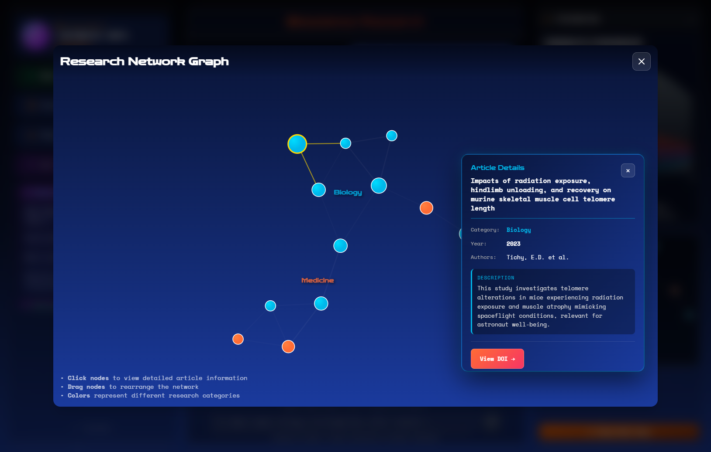

# NASA Explorer - Space Biology Knowledge Engine

## 🌌 Description

**NASA Explorer** is an intelligent knowledge engine that transforms decades of NASA space biology research into accessible information. Using AI and interactive visualization, it enables researchers and enthusiasts to explore scientific publications through natural language.

## 🎯 The Challenge

Build a dynamic dashboard that leverages AI and knowledge graphs to summarize NASA bioscience publications, making it easier to explore space experiments and their results.

## 💡 Our Solution

An intelligent research assistant that combines:

- **RAG (Retrieval-Augmented Generation)**: Verified answers extracted exclusively from official NASA documents
- **Graph visualization**: Interactive connections between scientific articles
- **Conversational chat**: Natural language search with persistent history

## 🏗️ Architecture

**Key Components:**

- **Frontend**: React SPA with Vite, featuring interactive D3.js knowledge graphs and real-time chat interface
- **Backend API**: Nest.js REST API handling authentication, conversation management, and orchestrating AI requests
- **AI & Data Layer**: RAG engine powered by Vertex AI (Gemini 2.5 Flash Lite) retrieves contextual information from NASA documents stored in Google Cloud Spanner, with MongoDB managing user data and conversation history

## 📸 Screenshots

  
  
<em>
  Landing Page: Welcome screen with call-to-action to explore NASA's space biology research
  </em>

  
  
  
<em>Main Dashboard: Interactive chat interface with real-time graph visualization</em>

  
  
<em>Knowledge Graph: Explore connections between scientific publications and research topics</em>

## ✨ Key Features

- RAG engine for contextualized information retrieval
- Interactive graphs showing relationships between articles
- Favorites system and conversation history
- Trends analysis in scientific publications
- Popular research topics identification

## 🌍 Impact

Facilitates access to NASA's scientific knowledge, accelerates the discovery of connections between studies, and identifies gaps in space research. Supports evidence-based decision-making for future missions.

## 👥 Team - Los Frijolitos Espaciales

- [**Teresa Rivas Gómez**](https://github.com/tessarivas) - UI/UX Design
- [**Danna Guadalupe Sandez Islas**](https://github.com/dannasndz) - UI/UX Design
- [**Fernando Haro Calvo**](https://github.com/Scalaptia) - Full Stack
- [**Jorge Antonio Vazquez Guzmán**](https://github.com/jvpresti) - Backend & Analyst
- [**Antonio Ramos Gonzalez**](https://github.com/anrago) - Full Stack
- [**Brayan Ivan Perez Ventura**](https://github.com/keiwv) - LLM Deployment

## 🔗 Links

- [Figma Prototype](https://www.figma.com/design/vSr77acj4Ma95dkhH5JnHS/NASA-2025-CHALLENGE?node-id=0-1&t=AxARPyBNDYSeIu7X-1)
- [Backend Repository](https://github.com/Anrago/NASA2025_BACK)
- [Deployment Link](https://nasaexplorer2025.vercel.app/)
- [Project Demonstration](https://drive.google.com/file/d/1QB3k02LbYLfx9gVH1l8yGPVAy5HdZtkN/view)
- [Project Documentation](https://drive.google.com/file/d/1YjKRWCGghTvzAnvC02F3J7GkYa6r4J6A/view?usp=sharing)
- [NASA Space Apps Project](https://www.spaceappschallenge.org/2025/find-a-team/los-frijolitos-espaciales/?tab=project)
